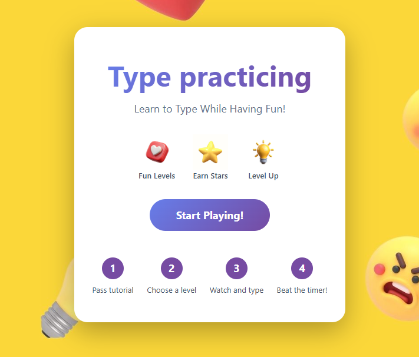
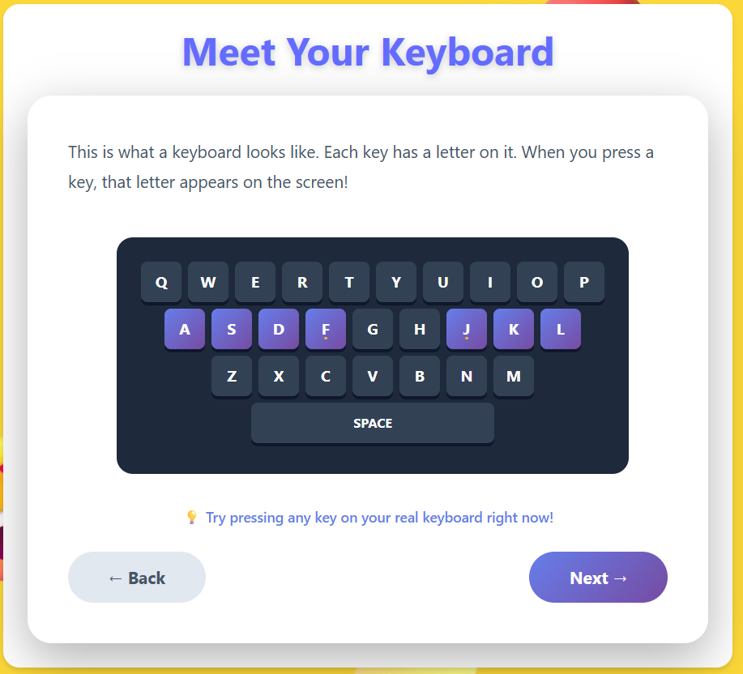
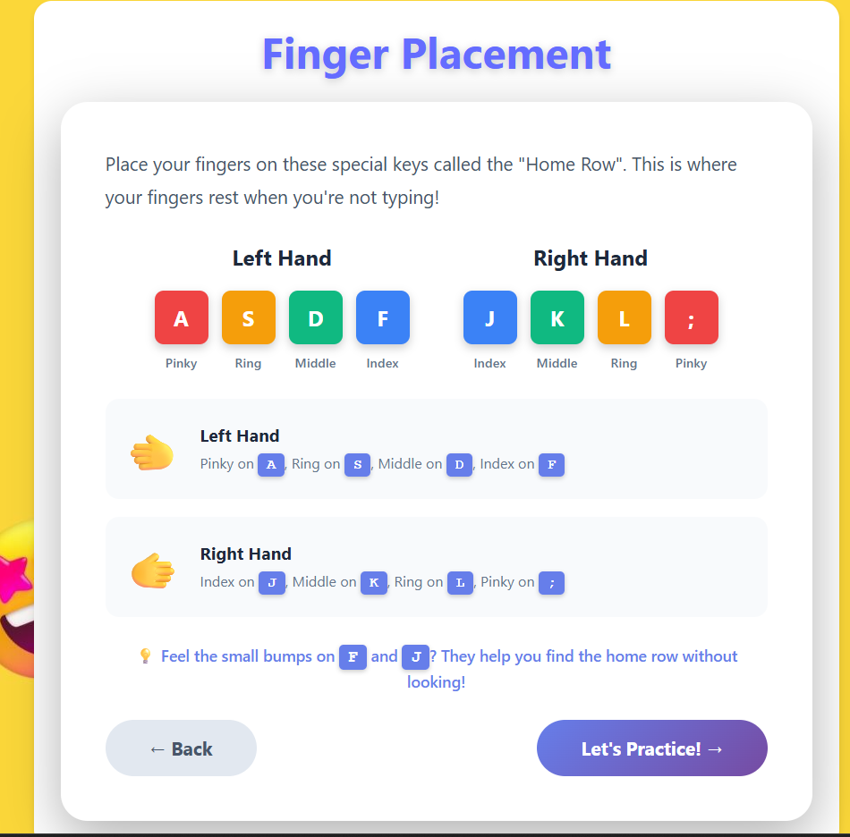
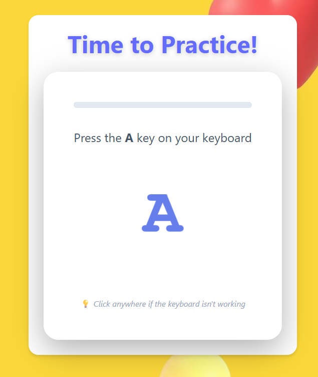
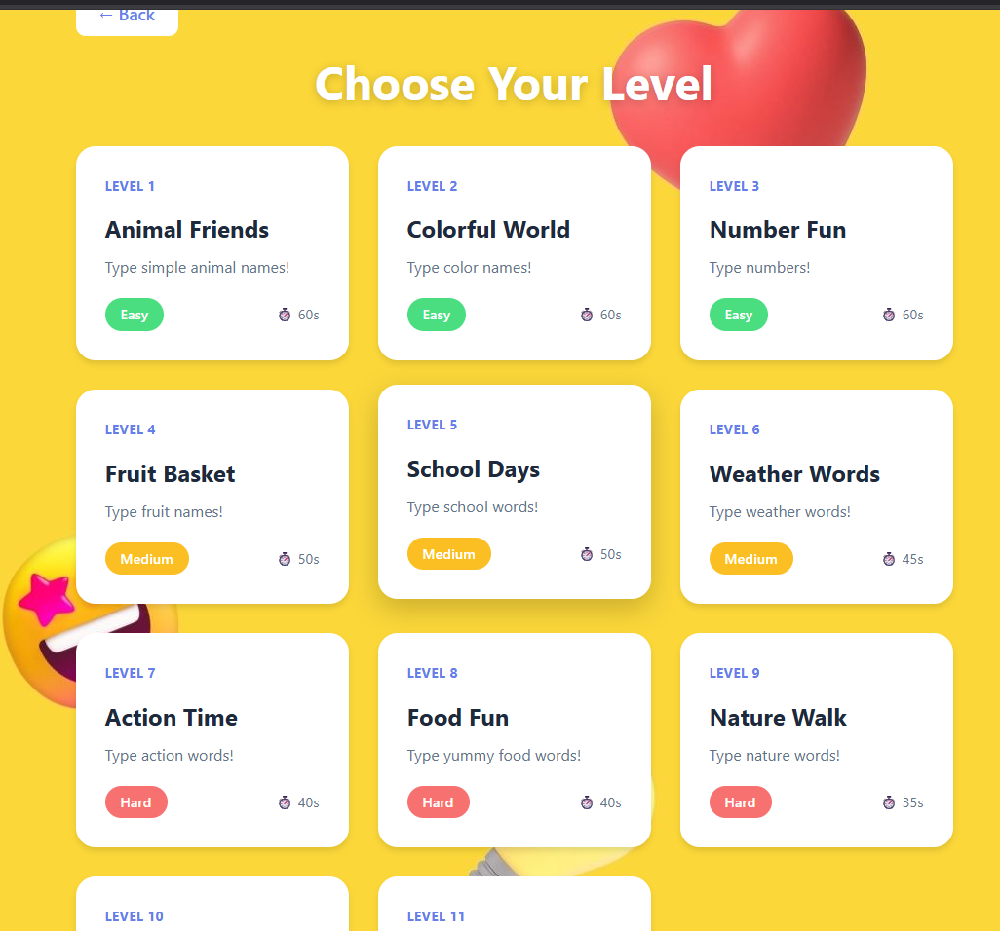
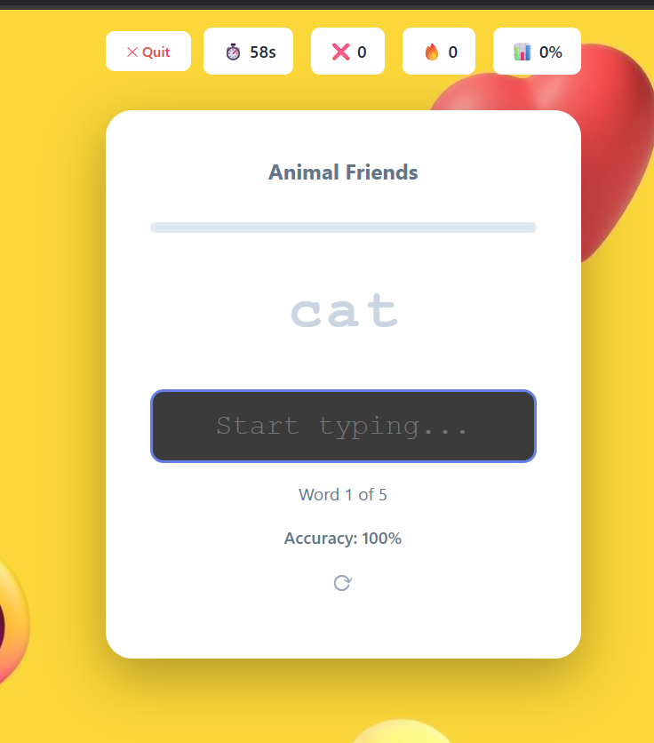
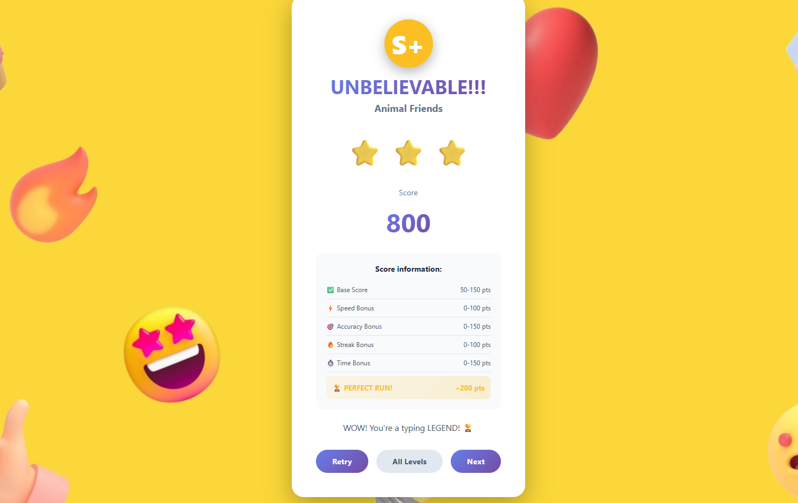

# Type Master Kids 

## What is this?

It's a simple gam
e where kids type words on the screen before time runs out. I made it colorful and fun because, honestly, learning to type can be pretty boring otherwise.

The game has:
- A tutorial that shows kids where to put their fingers
- 10 levels that get harder as you go
- Stars you can earn (because who doesn't like stars?)
- Big, friendly text and lots of emojis

## Want to try it?

You'll need Node.js installed on your computer. Then just:

```bash
git clone https://github.com/AmirMakir/type-master-kids.git
cd type-master-kids
npm install
npm start
```

It'll open in your browser.


# How It Works?
The application flow is simple and user-friendly, guiding the user step by step from onboarding to performance review.

## 1. Welcome Screen
When the application starts, the user is presented with a Welcome screen that introduces the app and sets the context for the learning experience.




## 2. Tutorial
If the user has not completed the tutorial yet, the app automatically redirects them to a Tutorial section. This tutorial explains the core mechanics and interaction rules of the application.





## 3. Practice Test
After completing the tutorial, the user is given a practice test. This step allows them to apply what they have learned in a controlled environment before progressing further.




## 4. Levels List
Once the tutorial and practice test are completed, the user gains access to the Levels List. Each level displays the following information:
- Level name
- Level ID
- Difficulty 
- Time limit
- Description




## 5. Typing Practice
By selecting a level, the user enters a typing practice session. The task is to accurately retype the word or text displayed on the screen within the given constraints.




## 6. Results and Review
After completing a level, the user is shown a results screen summarizing their performance. This review includes:
- Score
- Rating
- Detailed score breakdown
- From this screen, the user can:
- Retry the level
- Return to the levels list
- Proceed to the next level



## Project Structure

```
type-master-kids/
├── public/
│   ├── index.html
│   └── favicon.ico
├── src/
│   ├── components/     # React components
│   │   ├── images      # Image folder
│   │   ├── HomePage.tsx     # Landing page
│   │   ├── HomePage.css
│   │   ├── Tutorial.tsx     # Tutorial system
│   │   ├── Tutorial.css
│   │   ├── KeyboardGuide.tsx        # Visual keyboard
│   │   ├── KeyboardGuide.css
│   │   ├── FingerPractice.tsx       # Finger placement guide
│   │   ├── FingerPractice.css
│   │   ├── TutorialPractice.tsx     # Practice typing
│   │   ├── TutorialPractice.css
│   │   ├── LevelSelector.tsx        # Level selection screen
│   │   ├── LevelSelector.css
│   │   ├── GameLevel.tsx            # Main game logic
│   │   ├── GameLevel.css
│   │   ├── Results.tsx              # Results screen
│   │   └── Results.css
│   ├── data/
│   │   └── levels.ts        # Level descriptions
│   ├── types/
│   │   └── index.ts         # TypeScript interfaces
│   ├── App.tsx              # Main app component
│   ├── App.css              # Global styles
│   └── index.tsx            # Entry point
├── package.json
├── tsconfig.json
└── README.md
```

## What I learned

This project taught me a lot:
- How React actually works (not just tutorials)
- Why TypeScript is useful (catching bugs before they happen)

## Want to help?

If you see bugs or have ideas, feel free to open an issue or make a pull request. I'm still learning, so I'd appreciate any feedback!

## Technical stuff

Built with React, TypeScript, and CSS. No fancy libraries - just the basics. The whole thing is only frontend.
